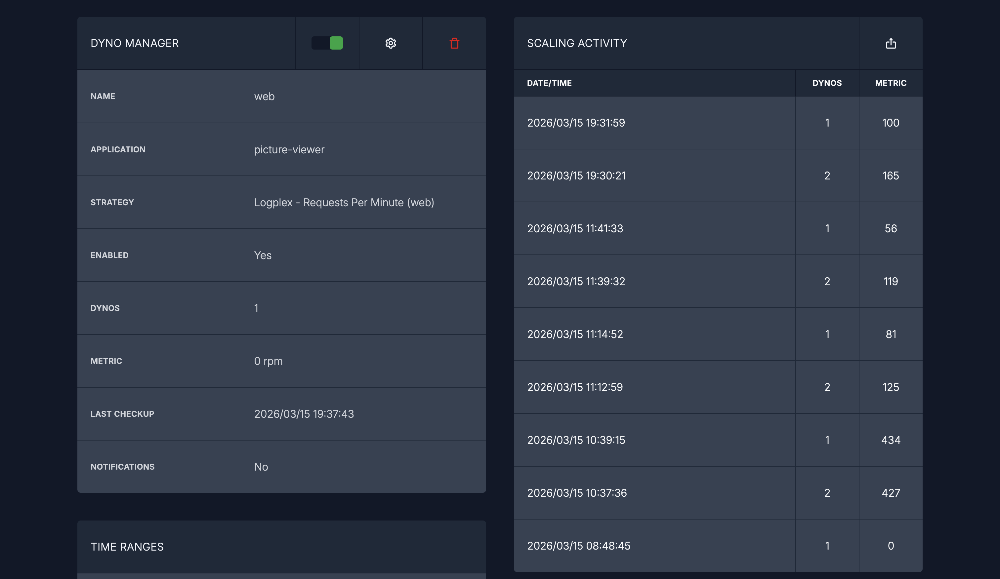

# Picture-viewer teljesítményteszt és skálázódás

### Skálázódás
Az automatikus skálázódás megvalósításához a Heroku beépített funkciói mellett a Hirefire szolgáltatást alkalmaztam. 
Ez az eszköz zökkenőmentesen integrálódik a Herokuval: folyamatosan monitorozza az alkalmazáshoz beérkező HTTP kérések számát, 
és amint a terhelés elér egy előre definiált küszöbértéket, automatikusan felskálázza a rendszert.

Az integrációhoz mindössze arra volt szükség, hogy a Heroku-fiókommal belépjek a Hirefire oldalán. 
Ezt követően meg kellett adnom a skálázandó alkalmazás nevét, és a rendszer már fel is ismerte azt. 
A skálázódás követelményeinek és küszöbértékeinek beállításához egy úgynevezett Dyno Managert kellett létrehoznom, 
amely több metrika alapján is lehetőséget kínál a skálázásra.

Először a response time metrikát próbáltam használni, de azzal nem lehetett elég megbízhatóan és látványosan skálázni az alkalmazást. 
Ezért végül a Logplex – Requests Per Minute módszert választottam, ami a percenként beérkező kérések számát figyeli, és ez alapján végzi a skálázást. 
Bár ez nem számít olyan bevett iparági szabványnak, mint például a hardveres erőforrások vagy a válaszidő figyelése, 
a laborfeladat szempontjából sokkal látványosabb eredményt hozott. 
Ahhoz, hogy ez megfelelően működjön, a Heroku-alkalmazáshoz még hozzá kellett adnom egy úgynevezett drain-t is, 
amelyen keresztül a rendszer jelenteni tudja a kérések számát a Hirefire számára.

A skálázási folyamat az alábbi képen látható:

### Terhelés szimuláció
A terhelés szimulálásához a Python-alapú Locust keretrendszert használtam. A teszteseteket a [locustfile.py](locustfile.py) fájlban definiáltam, amely a következő lépéseket tartalmazza:

1. Felhasználói bejelentkezés.
2. Fényképek listázása és lekérése.
3. Új fénykép feltöltése.
4. A feltöltött fénykép törlése.

A tesztkörnyezet futtatásához a Locust futtatásához szükséges kódot is a Heroku platformra telepítettem, és a terheléses tesztet ebből a környezetből indítottam el. 

**A teszt lefolyása:**
A szimuláció kezdetben 1 egyidejű felhasználóval indult, majd a terhelés fokozatosan 15 felhasználóig növekedett, végül pedig visszacsökkent az eredeti állapotra (1 felhasználó). A megnövekedett forgalom hatására a rendszer automatikusan 2 Dynóra (podra) skálázta fel az alkalmazást, majd a terhelés enyhülésével sikeresen visszaskálázta 1 Dynóra.

A futás részletes eredményei megtekinthetők a [Locust-report.html](report/Locust-report.html) jelentésben.
